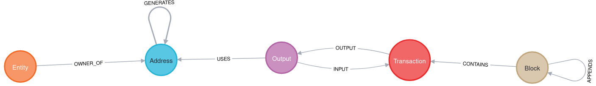

Bitcoingraph - A Python library for exploring the Bitcoin transaction graph.

## Difference with the "original" repository

The original repository was created in 2015 as a thesis for a university master degree. Since 2015, the 
blockchain bitcoin has changed a lot.

In 2021, author [s7p](https://github.com/s7p) made a fork to add the difficulty, connect blocks together, 
and fix some compatibility issues.

This fork contains large refactorings. On the compatibility side, the addresses were not sent back in the 
same format as they used to by bitcoind service (see https://github.com/btcsuite/btcd/issues/1874).
However, a much larger problem was the entity computation. The previous script was made in 2015, with the 
entire blockchain weighting a few GBs. Nowadays, it weights close to 1TB. The script was not adapted to 
this modern issue, and would require hundreds of GBs (we stopped testing after 200GB RAM, the exact number is unknown).

This required a complete overhaul of the entity computation. The script now contains arguments to limit the amount 
of memory used, meaning you can probably run it on 16GB RAM (I wouldn't personally, but it will work). There's a section
below regarding requirements and giving more details.


## Prerequisites

### OS Note
The code can only be run on UNIX compatible systems, as it makes use of `sort` and `uniq` terminal commands. 
The newer versions were only tested on linux, but the modifications made should not affect MAC OSX.
It was not tested on windows, it will not work on "native" windows, but could potentially work if run through 
some linux virtualisation (e.g. WSL) or some UNIX terminal system.

### Mac OSX specifics

Running bitcoingraph on a Mac requires coreutils to be installed

    homebrew install coreutils

### Hardware

The resources needed for creating the graph database are roughly proportional to the size of the database, up to some
limit. You could do testing and development with a tiny subset of all bitcoin transactions, e.g. the first 10000 blocks,
even on a Raspberry Pi. If you plan to import the entire blockchain, you will need much more serious hardware.

The basic requirements for a database up to July 2023 are:
- 4TB Disk Memory
- 48GB RAM
- A good CPU is nice to have as part of the pipeline uses it intesively 
- If you're going to run your own bitcoin node, a good internet connection
A detailed explanation of the hardware requirements can be [found here](docs/documentation.md#hardware-requirements) 

### Software

You will need neo4j >= 5.0 , python >= 3.9 with additional modules, PyPy, rust, and of course bitcoingraph. 
If you do not have access to an RPC Bitcoin API, you will need to run your own Bitcoin node.
Please refer to the section in the appendix for instructions.

#### Bitcoingraph library setup

Bitcoingraph is being developed in Python 3.9 Make sure it is running on your machine:

    python --version

Download and unpack or git clone, test and install the Bitcoingraph library:

    cd bitcoingraph
    pip install -r requirements.txt
    py.test
    python setup.py install

# What it creates

## Visualisation



### Explanation:

- `Block`: a bitcoin block, with property `height`. Appends to the previous block to create the chain.


- `Transaction`: a bitcoin transaction, with property `txid`


- `Output`: Output created from a transaction, which is then used as input for a later transaction. Contains the
  property `txid_n`, where `n` is the index of the output, and float `value` as the BTC value. A transaction `123` with
  2 outputs will create two nodes `123_0` and `123_1` both attached as in the outward direction

  ```(:Transaction)-[:OUTPUT]->(:Output)```

  When these outputs are used as input in a later transaction, a new link will be added:

  ```(:Transaction)-[:OUTPUT]->(:Output)-[:INPUT]->(newTransaction:Transaction)```


- `Address`: a bitcoin address, with property `address`. Old addresses using public keys are prefixed by `pk_`. The
  latter also generate their P2PKH and P2WPKH addresses, which are connected through the
  `(publicKey:Address)-[:GENERATES]->(p2pkh:Address)` relationship


- `Entity`: an entity is an extra node which is not part of the blockchain. It is computed in post-processing and is
  used to connect addresses that were used as input in the same transaction, basically making the assumption that it
  implies they come from the same "Entity". Entities are merged together, meaning for example:
    - Transaction `t1` receives inputs from addresses `a1`,`a2`,`a3`
        - an entity is created connecting these addresses, `e1`
    - Transaction `t2` receives inputs from addresses `a2`,`a4`
        - since `a2` is already part of an entity, then `a4` is added to that same entity `e1`
        - if `a4` was also already part of an entity, the two entities are merged into one

## Boostrapping the underlying graph database (Neo4J)

bitcoingraph stores Bitcoin transactions as directed labelled graph in a Neo4J graph database instance. This database
can be bootstrapped by loading an initial blockchain dump, performing entity computation over the entire dump as
described by [Ron and Shamir](https://eprint.iacr.org/2012/584.pdf), and ingesting it into a running Neo4J instance.

#### Important note
When we took over this project, it had last been used on data from 2016. We had to entirely 
re-write parts of the codebase due to the fact that the total bitcoin blockchain size at the time was
a couple of GBs, whereas nowadays, it's closer to 1TB. Many of the processes were not adapted for the size.

I would strongly suggest anyone wanting to do this on the real blockchain, to first do the whole process
at small scale. Using only the first 200k blocks, the entire process can be done on any average modern laptop in less 
than 2 hours (most of which will be waiting for computations). 
This way, one can get comfortable with the process and try the database at small scale. At real scale, the process takes
a couple of days total in various computation, hence why it's better to do a trial run first.

### Step 1: Create transaction dump from blockchain

Bitcoingraph provides the `bcgraph-export` tool for exporting transactions in a given block range from the blockchain.
The following command exports all transactions contained in block range 0 to 1000 using Neo4Js header format and
separate CSV header files:

    bcgraph-export 0 1000 -u your_rpcuser -p your_rpcpass

The following CSV files are created (with separate header files):

* **addresses.csv**: sorted list of Bitcoin addressed
* **blocks.csv**: list of blocks (hash, height, timestamp)
* **transactions.csv**: list of transactions (hash, coinbase/non-coinbase)
* **outputs.csv**: list of transaction outputs (output key, id, value, script type)
* **rel_block_tx.csv**: relationship between blocks and transactions (block_hash, tx_hash)
* **rel_input.csv**: relationship between transactions and transaction outputs (tx_hash, output key)
* **rel_output_address.csv**: relationship between outputs and addresses (output key, address)
* **rel_tx_output.csv**: relationship between transactions and transaction outputs (tx_hash, output key)

### Step 2: Compute entities over transaction dump


#### 2.1: Compute the entities
The following command computes entities for a given blockchain data dump:

    bcgraph-compute-entities -i blocks_0_1000 


This script is extremely computationally intensive, both in memory and in processing.
There are various parameters that can be tuned to optimize performance:

`--read-size`: Number of bytes to read at once from the file

`--chunk-size`: Size of a batch to process at once (in bytes)

`--cached-batches`: Number of last processed batches to keep in memory (uses a circular buffer)

`--max-queue-size`: Number of outputs to process together. This is the most important variable
both in terms of performance and memory usage. The higher, the better.

On our machine with 110G and AMD Ryzen 5 5600G, we used the following parameters:
```commandline
--cached-batches 5_000 --chunk-size 50_000 --read-size 100_000_000 --max-queue-size 5_000_000_000
```
and reached max usage of 65G of RAM, and took ~15 hours to complete.


#### 2.2: Merge the entities together

Once the entities are computed, we also need to run the following
```bash
cd merge-entities && cargo run --release /path/to/rel_entity_address.csv /path/to/rel_entity_address_merged.csv
```
The first generates computes entities, but due to the size of the file, it has to be 
done in pieces. Therefore, if the entire entities happen to be over to pieces of the 
file, it wrongly creates two entities. That's the reason for merge-entities script,
which is written in `rust` for performance purposes and merged all entities that 
were separated back together. The second argument is the output file, in theory it can 
be the same as the input, but what we used (and is used throughout this README) is simply
adding the \_merged suffix.


Two additional files are created:

* entities.csv: list of entity identifiers (entity_id)
* rel_address_entity_merged.csv: assignment of addresses to entities (entity_id, address)

#### Note: what is this about?
Check the [extended documentation](docs/documentations#entities-process)

### Step 3: Compute P2PKH and P2WPKH addresses
The raw data doesn't include the connection between addresses in the format public key, and the 
P2PKH and P2WPKH addresses that are "generated" by the latter. This script computes all the generated 
addresses, and creates a file `rel_address_address.csv` and `rel_address_address_header.csv`.

```
bcgraph-pk-to-addresses -i blocks_0_1000
```

### Step 4: Ingest pre-computed dump into Neo4J

Install [Neo4J][neo4j] community edition (>= 5.0.0):

Get an rpm, deb or tar directly from [neo4j]https://neo4j.com/download-center/#community 
or, preferably, install a [dnf]https://yum.neo4j.com/ or [apt]https://debian.neo4j.com/ 
repo as appropriate for your distribution. The dnf/apt method has the additional advantage 
of easy upgrades without the risk of accidentally overwriting your configuration files. 

Edit neo4j.conf as needed. If you plan to import the entire blockchain, you will probably
need to set 

server.directories.data=/path/to/3TB/of/free/space/neo4j/data

The last two directories of the above path must be owned by the neo4j user. 

Before you start neo4j for the first time, you can set an initial password with 

`neo4j-admin dbms set-initial-password <password> [--require-password-change]`

Test the Neo4J installation:

    systemctl start neo4j
    http://localhost:7474/

Stop the database and remove any pre-existing databases:

    systemctl stop neo4j
    sudo rm -rf /var/lib/neo4j/data/*

Note: this will also delete your initial password. Set it again as needed. 

Switch back into the dump directory and create a new database using Neo4J's CSV importer tool:

```bash
neo4j-admin database import full --overwrite-destination 
  --nodes=:Block=blocks_header.csv,blocks.csv 
  --nodes=:Transaction=transactions_header.csv,transactions.csv 
  --nodes=:Output=outputs_header.csv,outputs.csv
  --nodes=:Address=addresses_header.csv,addresses.csv 
  --relationships=CONTAINS=rel_block_tx_header.csv,rel_block_tx.csv 
  --relationships=APPENDS=rel_block_block_header.csv,rel_block_block.csv 
  --relationships=OUTPUT=rel_tx_output_header.csv,rel_tx_output.csv 
  --relationships=INPUT=rel_input_header.csv,rel_input.csv 
  --relationships=USES=rel_output_address_header.csv,rel_output_address.csv 
  --nodes=:Entity=entity_header.csv,entity.csv 
  --relationships=OWNER_OF=rel_entity_address_header.csv,rel_entity_address_merged.csv  
  --relationships=GENERATES=rel_address_address_header.csv,rel_address_address.csv 
  <database name>
```
If you did the import as any user other than neo4j, `chown -R neo4j:neo4j /path/to/neo4j/data`. 
Then, start neo4j and the Cypher shell...:

    `systemctl start neo4j`
    `cypher-shell -u <username> -p <password> -d <database>`

and create the following indexes:

```
    // Allows fast queries using the address (highly recommended)
    CREATE CONSTRAINT FOR (a:Address) REQUIRE a.address IS UNIQUE;
    
    // Allows fast queries using the block height (highly recommended)
    CREATE CONSTRAINT FOR (b:Block) REQUIRE b.height IS UNIQUE;
    
    // Allows fast queries using the output txid_n (Optional)
    CREATE CONSTRAINT FOR (o:Output) REQUIRE o.txid_n IS UNIQUE;

    // Allows fast queries using transaction txid (Optional)
    CREATE CONSTRAINT FOR (t:Transaction) REQUIRE t.txid IS UNIQUE;
    
    // Allows fast queries using entity_id (Optional)
    CREATE CONSTRAINT FOR (e:Entity) REQUIRE e.entity_id IS UNIQUE;
    
    // Allows fast queries using entity name, only if you plan on naming entities. By default
    // no names are present (Optional)
    CREATE INDEX FOR (e:Entity) ON (e.name);
```

Finally, start Neo4J

    systemctl start neo4j

### Step 4: Enable synchronization with Bitcoin block chain

Bitcoingraph provides a synchronisation script, which reads blocks from bitcoind and writes them into Neo4j. It is
intended to be called by a cron job which runs daily or more frequent. For performance reasons it is no substitution for
steps 1-3.

    bcgraph-synchronize -s localhost -u RPC_USER -p RPC_PASS -S localhost -U NEO4J_USER -P NEO4J_PASS --rest

## Contributors

* [Bernhard Haslhofer](mailto:bernhard.haslhofer@ait.ac.at)
* [Roman Karl](mailto:roman.karl@ait.ac.at)


## License

This original library is released under the [MIT license](http://opensource.org/licenses/MIT). All changes on this fork
are released under [GPL 3 license](https://www.gnu.org/licenses/gpl-3.0.html)

[bc_core]: https://github.com/bitcoin/bitcoin "Bitcoin Core"

[bc_conf]: https://en.bitcoin.it/wiki/Running_Bitcoin#Bitcoin.conf_Configuration_File "Bitcoin Core configuration file"

[neo4j]: http://neo4j.com/ "Neo4J"

